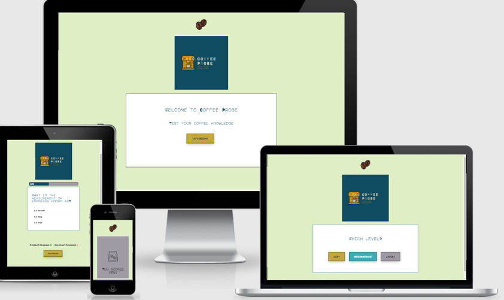
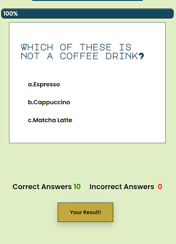
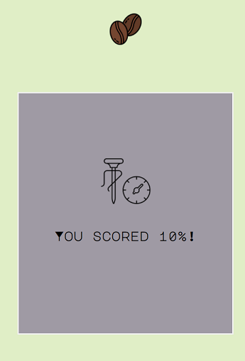
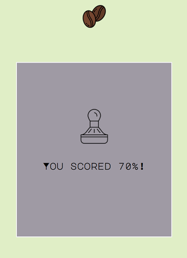
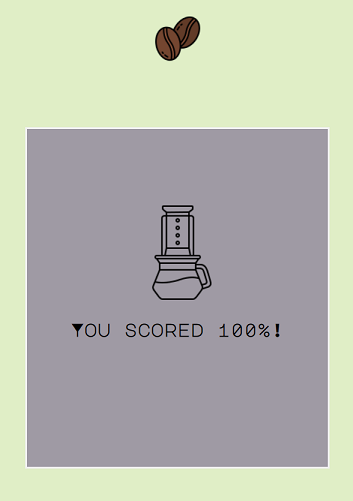
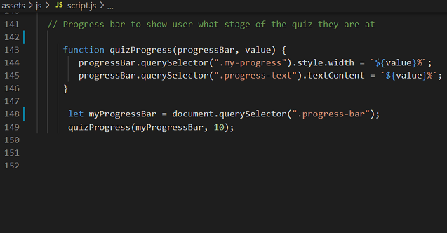
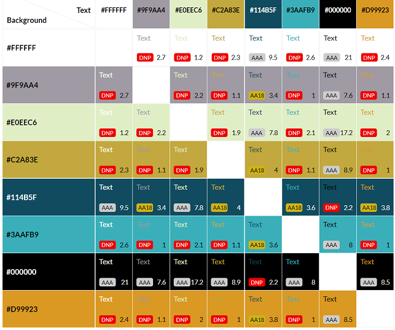
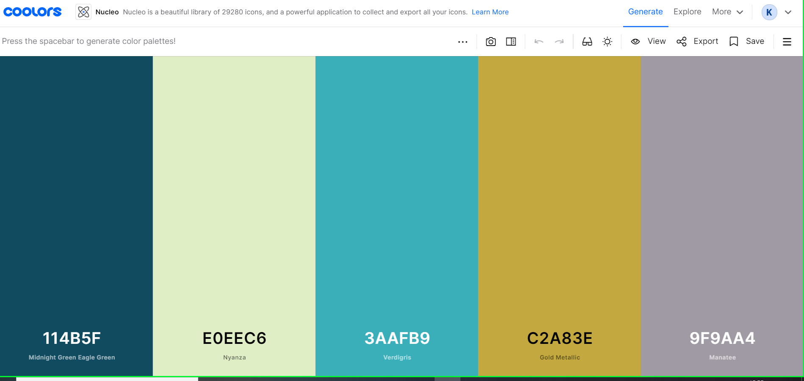
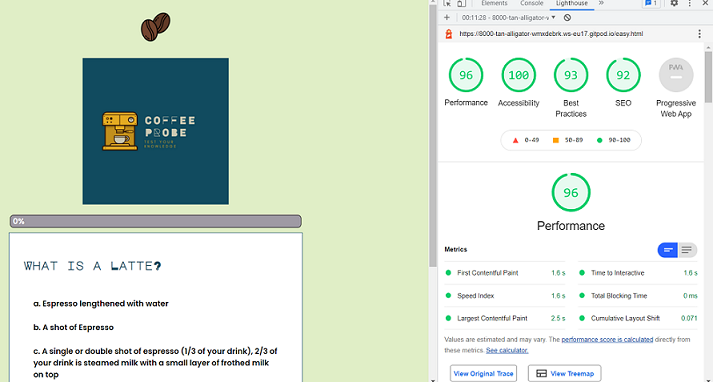

# COFFEE PROBE

Coffee probe is an interactive quiz to test your knowledge of all things coffee! For the coffee lovers, and coffee curious alike. Coffee probe is a fun way to test coffee knowledge and learn a few new facts along the way. From coffee origin processing, to espresso and latte art, the quiz covers many different aspects of coffee making and technique.
 
 

The quiz is made up of 3 sections of questions:
 
  - Easy
  - Intermediate 
  - Expert
 

### USER STORIES

 
As a user I want to:
 

  - Seamlessly navigate the quiz with intuitive navigation in place
  - Have a running score indicator to check my progress
  - Be challenged by the questions at each level
  - Be able to move through each quiz question without any glitches
  - Be presented with a final score at the end of the quiz
  - Find additional resources to educate myself further
 

### FEATURES

#### HOME NAV

 
At the top of the screen there is a coffee bean icon which the user can click on to navigate back to the home page. This icon was found on flaticon:
 
 

 
 

#### LOGO

 
The logo was made using canva, and this particular template:
 

[Logo Template](https://www.canva.com/design?create&type=TAB7AVEOUWQ&template=EADZ4KRPdc0&category=tACZCvjI6mE&analyticsCorrelationId=b9361aa1-9507-47ab-a858-be3cdb5a90b6&schema=web-2)
 
The logo has a sleek look and is instantly recognisable as an espresso machine. The logo font

[Major Mono Display](https://fonts.google.com/specimen/Major+Mono+Display#standard-styles) is suited to a quiz format, with its' constructivist design, it is bold and striking. The logo is consistent in style and size throughout the application, for a seamless user experience.

 

#### INTRO MESSAGE AND BEGIN BUTTON

 
On the homepage there is a simple Welcome Message to the quiz user displayed in a box below the logo. I have used the same font as the logo font for consistency. The message is short and to the point "Welcome to Coffee Probe. Test your coffee knowledge". The user has no question as to the theme of the quiz. 
 
Below the welcome message there is a button displaying "Let's begin" which will load a pop-up for the user to input their details.
 
 

 

#### USER DETAILS POP-UP

 
The user pop-up form allows the user to input their name and email. The intial plan for this data was to implement sessionStorage for the input. I ran out of time to go back and do this, so would defintely improve on this in the future, and be able to use prompts with the users name, and when I declare their results. 
 
 

 

#### LEVEL BUTTONS

 
On submitting the users' details they are taken to the quiz levels page, where they can select easy, intermediate or expert questions.
 
 

 

I have included a hover effect on the buttons. When the user hovers over one of the buttons the text color changes to white, to make the user experience more dynamic.
 
 

 

#### QUIZ SECTION

 
Once the user has selected a level they are taken to the quiz page and the first question is rendered. The quiz section is made up of a few different elements. The nav button and logo remain in the same place as the previous pages. There is a progress bar which shows the user the percentage of the quiz they have completed. Below this is the quiz question with three possible answers. When the user hovers over an answer a gold background color effect is displayed. Once they have clicked on their choice the next question is rendered, and the progress bar is updated. Below this section is also a running score tally which will update the scores as the answers are calculated.
 
 

 
 

#### DISPLAYING USER SCORES

 
Once the user has reached the end of whichever question level they have chosen they can click on a button at the button of the score tally to open up their final score display. I have kept this pop-up minimilistic, and included 4 different coffee related images depending on what score percentage they achieved. These range based on the user scoring 0-20%, 20%-50%, 50%-70%, and 70% and over.
 
 
  
 
 
  
 
 

### FEATURES FOR FUTURE INCLUSION

 
There are a lot of things I would have liked to include in the quiz if I had to do it again. Some of these are as follows:
 

- A timer to limit the amount of time the user has to answer
- Have the whole project run on one or two html pages, and one JavaScript page rather than having to link them all
- An education section where the user can go to find further learning resources
- A personalised message by capturing the user's name input and displaying at the end when showing the user's score
 
 

### CREDITS

#### CODE

 

https://www.w3schools.com/css/css3_buttons.asp

https://www.w3schools.com/tags/att_form_action.asp

https://www.w3schools.com/howto/howto_js_popup_form.asp

Code Institute Love Maths Project:
 
 
I used the code for my running scores using the Love Maths project.
 

https://github.com/Code-Institute-Org/love-maths

 
* A big thank you to fellow Code Institute student Dave Horrocks for advice and help with progress bar code *

 

#### YOUTUBE TUTORIALS

 

https://www.youtube.com/watch?v=kjhsS4lNZ9o  *progress bar*
 
 
At first I used this progress bar video to code a progress bar, as it was almost what I wanted for my project. I got everything working, but the one issue was the actual progress value had to be inputted, rather it automatically updating as the quiz progressed. I tried different variations but could not get it to loop.
 
 

https://www.youtube.com/watch?v=49pYIMygIcU *multi choice quiz*
 
 
I used the multi choice quiz code to structure most of my quiz. There were additional features taught but I didn't think they would suit my project e.g. using images for the individual questions. I found the score results feature to be extremely helpful. With some tweeking to the math function I was able to run the function to display the users'score at the end of the quiz. The tutorial code was giving me percentage values less than 10% due to it being a different length quiz, I was able to fix this by multiplying the user score by 10 to get an accurate percentage result.

#### CONTENT

 

Quiz created by myself with some info taken from 
[Code Black Coffee](https://codeblackcoffee.com.au/blogs/)
 

[Contrast Grid](https://color.adobe.com/create/color-wheel)
 
 
I used Contrast Grid to test accesibility for my colour scheme.
 

[Coolors.co](https://coolors.co/114b5f-e0eec6-3aafb9-c2a83e-9f9aa4)
 
I used Coolors.co to create a colour palette for the quiz. I wanted something simple, yet still interesting. The colours compliment a simple, minamilist design as to not draw attention away from the quiz content and features.
 
 
'
 

[Favicon-converter] (https://favicon.io/favicon-converter/)

 Flaticon Icons 
  
 *For use in the quiz results pop-up*

   
Icons made by <a href="https://www.flaticon.com/authors/amethystdesign" title="AmethystDesign">AmethystDesign</a> from <a href="https://www.flaticon.com/" title="Flaticon">www.flaticon.com</a>

   
Icons made by <a href="" title="bsd">bsd</a> from <a href="https://www.flaticon.com/" title="Flaticon">www.flaticon.com</a>
 

   
Icons made by <a href="" title="photo3idea_studio">photo3idea_studio</a> from <a href="https://www.flaticon.com/" title="Flaticon">www.flaticon.com</a>

 
 

 ### BUGS AND ISSUES
 

  
 

 

 ### TESTING
 

  

 - I used Lighthouse to check accessibility and the site passed:
  
 
  
  

 - I checked the project with Devtools and no project related errors were found.

### VALIDATION

 
The HTML passed through the 

[ValidatorW3.org](https://validator.w3.org/nu/?doc=https%3A%2F%2Fkreilly86.github.io%2Fcoffee-probe%2F)
 
 
The CSS passed through the 

[WSC CSS Validation](https://jigsaw.w3.org/css-validator/validator?uri=https%3A%2F%2Fkreilly86.github.io%2Fcoffee-probe%2F&profile=css3svg&usermedium=all&warning=1&vextwarning=&lang=en)
 
 

